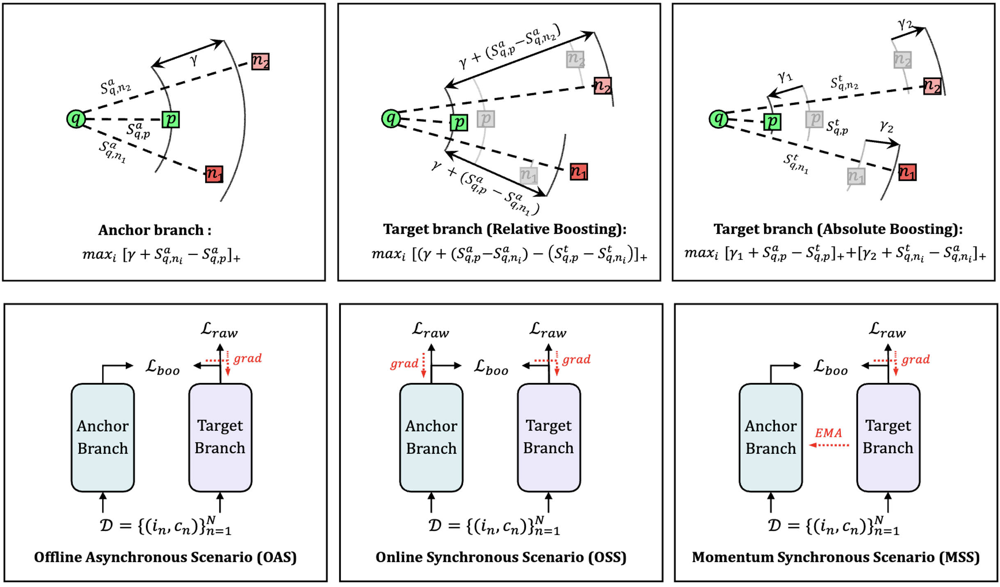

# DBL 

*PyTorch implementation for TIP2024 paper of [**“Deep Boosting Learning: A Brand-new Cooperative Approach for Image-Text Matching”**](https://arxiv.org/abs/2404.18114).*  

*It is built on top of the [SGRAF](https://github.com/Paranioar/SGRAF), [DML](https://github.com/YingZhangDUT/Deep-Mutual-Learning), [DINO](https://github.com/facebookresearch/dino) and [Awesome_Matching](https://github.com/Paranioar/Awesome_Matching_Pretraining_Transfering).*  

*If any problems, please contact me at r1228240468@gmail.com. (diaohw@mail.dlut.edu.cn is deprecated)*

## Introduction

**The framework of DBL:**



## Requirements 
Utilize `pip install -r requirements.txt` for the following dependencies.

*  Python 3.7.11  
*  PyTorch 1.7.1   
*  NumPy 1.21.5 
*  Punkt Sentence Tokenizer:
```python
import nltk
nltk.download()
> d punkt
```

## Download data and vocab
We follow [SCAN](https://github.com/kuanghuei/SCAN) to obtain image features and vocabularies, which can be downloaded by using:

```bash
https://www.kaggle.com/datasets/kuanghueilee/scan-features
```
Another download link is available below：

```bash
https://drive.google.com/drive/u/0/folders/1os1Kr7HeTbh8FajBNegW8rjJf6GIhFqC
```

```
data
├── coco_precomp
│   ├── train_ids.txt
│   ├── train_caps.txt
│   └── ......
│
└── f30k_precomp
    ├── train_ids.txt
    ├── train_caps.txt
    └── ......
```

## Pre-trained models and evaluation
Modify the **model_path**, **split**, **fold5** in the `test.py` file. 
Note that `fold5=True` is only for evaluation on MSCOCO1K (5 folders average) while `fold5=False` for MSCOCO5K and Flickr30K. Pretrained models can be downloaded from [Here](https://pan.baidu.com/s/1742zjzGVp2eeS3FrDX5KoA) with password [dhw4].

Then run `python test.py` in the terminal.

## Training new models from scratch
Uncomment the required parts in the `script.sh` file. 

Then run `bash script.sh` in the terminal:

## Reference

If DBL is useful for your research, please cite the following paper:  

    @article{Diao2024DBL,
        author={Diao, Haiwen and Zhang, Ying and Gao, Shang and Ruan, Xiang and Lu, Huchuan},
        title={Deep Boosting Learning: {A} Brand-New Cooperative Approach for Image-Text Matching},
        journal={IEEE Transactions on Image Processing},
        year={2024},
        volume={33},
        pages={3341--3352}
    }

## License

[Apache License 2.0](http://www.apache.org/licenses/LICENSE-2.0).  
